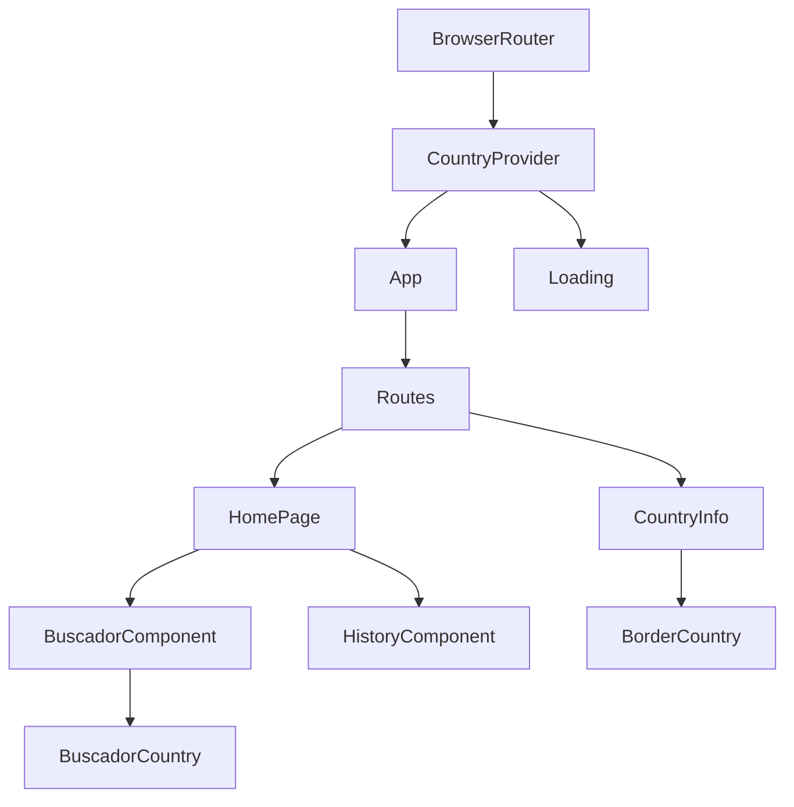

## Technology Stack

Countrysweb is built with modern web technologies:

<CardGroup cols={2}>
  <Card title="React 18" icon="react">
    Component-based UI library with hooks
  </Card>
  <Card title="Vite" icon="bolt">
    Fast build tool and dev server
  </Card>
  <Card title="React Router" icon="route">
    Client-side routing for SPA navigation
  </Card>
  <Card title="Axios" icon="globe">
    HTTP client for REST Countries API
  </Card>
</CardGroup>

## Project Structure

The application follows a standard React project organization:

```
src/
├── api/              # API configuration and endpoints
│   ├── axios.js      # Axios instance with base URL
│   └── country.js    # Country API methods
├── components/       # React components
│   ├── HomePage.jsx
│   ├── CountryInfo.jsx
│   ├── BuscadorComponent.jsx
│   ├── BuscadorCountry.jsx
│   ├── HistoryComponent.jsx
│   ├── BorderCountry.jsx
│   ├── Loading.jsx
│   └── Icons.jsx
├── context/          # Context API for state management
│   ├── CountryContext.jsx
│   └── CountryProvider.jsx
├── hooks/            # Custom React hooks
│   └── useCountryInfo.js
├── utils/            # Utility functions
│   └── libs.js
├── App.jsx           # Root component with routing
├── main.jsx          # Application entry point
└── index.css         # Global styles
```

## Application Entry Point

The application initializes in `main.jsx` with a clear hierarchy:

```jsx main.jsx
import { createRoot } from "react-dom/client";
import "./index.css";
import App from "./App.jsx";
import { BrowserRouter } from "react-router-dom";
import { CountryProvider } from "./context/CountryProvider.jsx";

createRoot(document.getElementById("root")).render(
  <BrowserRouter>
    <CountryProvider>
      <App />
    </CountryProvider>
  </BrowserRouter>,
);
```

<Steps>
  <Step title="BrowserRouter">
    Enables client-side routing for the entire application
  </Step>
  <Step title="CountryProvider">
    Wraps the app with global state management for countries data
  </Step>
  <Step title="App Component">
    Renders routes and handles navigation between pages
  </Step>
</Steps>

## Component Hierarchy



<Note>
  The `Loading` component is rendered at the provider level, making it globally accessible across all routes.
</Note>

## Data Flow Architecture

The application follows a unidirectional data flow pattern:

<Steps>
  <Step title="API Layer">
    Axios instance configured with REST Countries API base URL (`https://restcountries.com/v3.1`)
    
    ```js api/axios.js
    import axios from "axios";
    
    const instance = axios.create({
      baseURL: "https://restcountries.com/v3.1",
    });
    
    export default instance;
    ```
  </Step>
  
  <Step title="API Methods">
    Abstracted API calls for country data:
    
    ```js api/country.js
    import axios from "./axios.js";
    
    export const getAll = () =>
      axios.get("/all?fields=name,capital,flags,population,cca3,translations");
    
    export const getByName = (name) => {
      return axios.get(`/name/${name}`);
    };
    ```
  </Step>
  
  <Step title="Context Layer">
    `CountryProvider` fetches all countries on mount and stores them in context:
    
    - Loads all countries from API
    - Manages global loading state
    - Persists search history to localStorage
    - Provides data to all child components
  </Step>
  
  <Step title="Component Layer">
    Components consume context data via the `useCountry` hook:
    
    - Read from global state
    - Trigger state updates
    - Display data to users
  </Step>
</Steps>

## State Management Strategy

### Global State (Context)

Managed by `CountryProvider` and accessible throughout the app:

- `countries` - Array of all country data
- `isLoading` - Loading indicator state
- `history` - User's search history (persisted to localStorage)

### Local State (Component)

Used for component-specific concerns:

- Form input values
- Error states
- UI toggle states

<Tip>
  The app uses Context API instead of Redux for simplicity, as the state management needs are straightforward.
</Tip>

## Performance Considerations

### Data Fetching

1. **Initial Load**: All countries are fetched once on app mount
2. **Detail View**: Individual country details fetched on demand
3. **Caching**: Countries list cached in context (no refetching)

### Search Optimization

The search functionality uses in-memory filtering:

```js
// No API calls - searches cached countries array
const pais = countries.find((country) => {
  const nameSpa = country.translations.spa.common;
  const nameEng = country.name.common;
  const cca3 = country.cca3;

  return (
    normalize(nameSpa) === normalize(entry) ||
    normalize(nameEng) === normalize(entry) ||
    normalize(cca3) === normalize(entry)
  );
});
```

### localStorage Persistence

Search history is automatically persisted:

```jsx
useEffect(() => {
  localStorage.setItem("history", JSON.stringify(history));
}, [history]);
```

## Design Patterns

<CardGroup cols={2}>
  <Card title="Provider Pattern" icon="layer-group">
    Context API wraps the app to provide global state access
  </Card>
  <Card title="Custom Hooks" icon="hook">
    Business logic extracted into reusable hooks like `useCountryInfo`
  </Card>
  <Card title="Component Composition" icon="puzzle-piece">
    Small, focused components combined to build features
  </Card>
  <Card title="Container/Presentational" icon="boxes">
    Smart components handle logic, presentational components handle UI
  </Card>
</CardGroup>

## Error Handling

The application handles errors at multiple levels:

```jsx
// API Level
try {
  const res = await getAll();
  setCountries(res.data);
} catch (error) {
  console.error("Error al obtener países:", error);
} finally {
  setIsLoading(false);
}

// Component Level
if (!pais) {
  return setError(true);
}
```

<Warning>
  Currently, errors are logged to console. Consider implementing user-facing error messages in production.
</Warning>