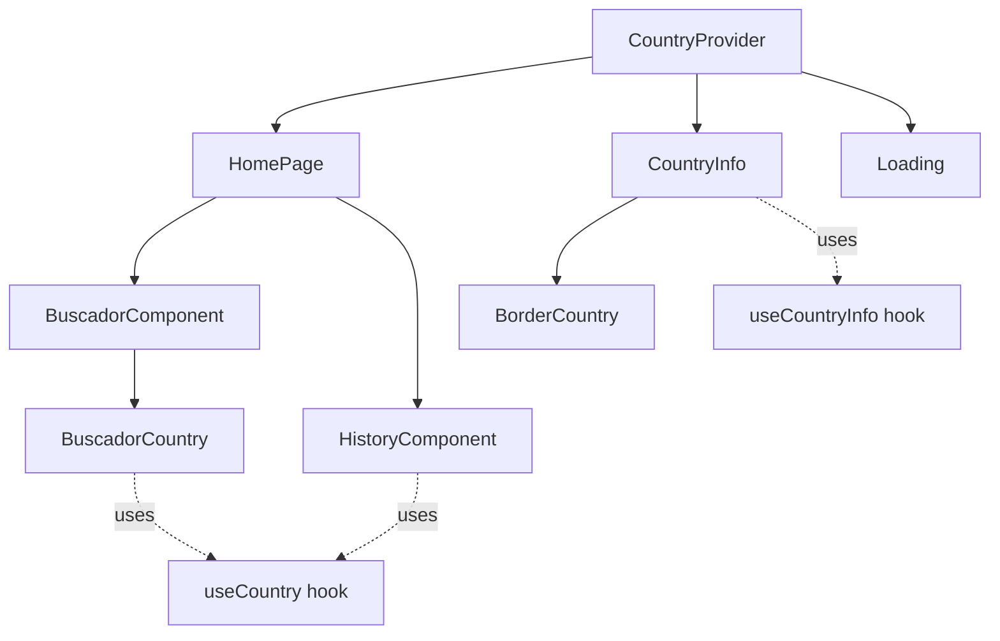

## Component Overview

Countrysweb consists of 8 main components organized by functionality. Each component is built with React hooks and follows modern best practices.

## Page Components

<CardGroup cols={2}>
  <Card title="HomePage" icon="home" href="#homepage">
    Main landing page with search and history
  </Card>
  <Card title="CountryInfo" icon="flag" href="#countryinfo">
    Detailed country information page
  </Card>
</CardGroup>

### HomePage

**Location**: `src/components/HomePage.jsx`

The main landing page that combines search functionality with search history.

```jsx HomePage.jsx
import { BuscadorComponent } from "./BuscadorComponent.jsx";
import { HistoryComponent } from "./HistoryComponent.jsx";

export function HomePage() {
  return (
    <>
      <BuscadorComponent />
      <HistoryComponent />
    </>
  );
}
```

**Features:**
- Displays country search interface
- Shows search history below the search bar
- Minimal logic - pure composition component

**Usage:**
```jsx
<Route path="/" element={<HomePage />} />
```

### CountryInfo

**Location**: `src/components/CountryInfo.jsx`

Detailed view of a selected country with comprehensive information.

```jsx CountryInfo.jsx
import { BorderCountry } from "./BorderCountry";
import { useCountryInfo } from "../hooks/useCountryInfo";
import { useParams } from "react-router-dom";

export const CountryInfo = () => {
  const { name } = useParams();
  const { country, countries, handleBack, formatPopulation } =
    useCountryInfo(name);

  const getContinentIcon = () => {
    const continents = country.region;
    if (continents.includes("Europe") || continents.includes("Africa")) {
      return <GlobeEurope />;
    }
    if (continents.includes("Asia") || continents.includes("Australia")) {
      return <GlobeAsia />;
    }
    return <GlobeAmericas />;
  };

  if (Object.keys(country).length > 0) {
    return (
      <section className="country-info">
        <button className="btn-back row" onClick={handleBack}>
          <ArrowLeft />
          Volver
        </button>
        <header>
          <div className="imgs">
            
            
          </div>
          <div className="info">
            <h1>{country.translations.spa.common}</h1>
            <span>
              <h4>Nombre Oficial: </h4>
              <p>{country.translations.spa.official}</p>
            </span>
          </div>
        </header>
        {/* Additional content... */}
      </section>
    );
  }
};
```

**Features:**
- Displays country flag and coat of arms
- Shows capital, region, continent, and population
- Lists bordering countries with navigation
- Displays all spoken languages
- Dynamic continent icons based on region
- Back button navigation

**Props:**
- Receives `name` from URL params via React Router

**Custom Logic:**
- `getContinentIcon()` - Returns appropriate globe icon for region
- `formatPopulation()` - Formats numbers with commas (from hook)

## Search Components

<CardGroup cols={2}>
  <Card title="BuscadorComponent" icon="magnifying-glass" href="#buscadorcomponent">
    Search container with header
  </Card>
  <Card title="BuscadorCountry" icon="input-text" href="#buscadorcountry">
    Search form with validation
  </Card>
</CardGroup>

### BuscadorComponent

**Location**: `src/components/BuscadorComponent.jsx`

Container component that wraps the search functionality with a header.

```jsx BuscadorComponent.jsx
import { useCountry } from "../context/CountryContext.jsx";
import Buscador from "./BuscadorCountry.jsx";
import { Globe } from "./Icons.jsx";

export const BuscadorComponent = () => {
  const { countries } = useCountry();

  return (
    <section className="search-container">
      <header>
        <h1 className="title row">
          Buscador de Paises
          <Globe />
        </h1>
        <p>
          Datos disponibles de <b>{`+${countries.length} paises.`}</b>
        </p>
      </header>
      <Buscador />
    </section>
  );
};
```

**Features:**
- Displays page title with globe icon
- Shows count of available countries
- Wraps the search form component

### BuscadorCountry

**Location**: `src/components/BuscadorCountry.jsx`

The actual search form with input validation and navigation logic.

```jsx BuscadorCountry.jsx
import { useNavigate } from "react-router-dom";
import { useRef, useState } from "react";
import { useCountry } from "../context/CountryContext";
import { normalize } from "../utils/libs.js";

function BuscarCountry() {
  const inputRef = useRef(null);
  const [error, setError] = useState(false);
  const { countries, setIsLoading } = useCountry();
  const navigate = useNavigate();

  const handleSearch = (e) => {
    e.preventDefault();
    const entry = inputRef.current.value;
    if (!entry) return;
    
    const pais = countries.find((country) => {
      const nameSpa = country.translations.spa.common;
      const nameEng = country.name.common;
      const cca3 = country.cca3;

      return (
        normalize(nameSpa) === normalize(entry) ||
        normalize(nameEng) === normalize(entry) ||
        normalize(cca3) === normalize(entry)
      );
    });

    if (!pais) {
      return setError(true);
    }
    
    setIsLoading(true);
    const nameCountry = pais.translations.spa.common;
    navigate(`/country/${normalize(nameCountry)}`);
  };

  return (
    <form className={`search-form ${error ? "error" : ""}`} onSubmit={handleSearch}>
      <input
        ref={inputRef}
        type="text"
        placeholder="Ingrese un pais para empezar la busqueda."
        onChange={(e) => {
          if (e.target.value.length === 0) setError(false);
        }}
      />
      <button>
        <Search />
      </button>
      <p className={`error ${error ? "" : "hidden"}`}>Pais no encontrado</p>
    </form>
  );
}
```

**Features:**
- Searches by Spanish name, English name, or 3-letter code
- Real-time error state management
- Normalizes input for better matching
- Navigates to country detail on match
- Shows error message for invalid searches

**Search Algorithm:**
1. Normalize user input (lowercase, remove accents)
2. Search in cached countries array
3. Match against Spanish name, English name, or CCA3 code
4. Navigate if found, show error if not

## History Components

<CardGroup cols={2}>
  <Card title="HistoryComponent" icon="clock-rotate-left" href="#historycomponent">
    Displays recent searches
  </Card>
  <Card title="BorderCountry" icon="border-all" href="#bordercountry">
    Clickable border country item
  </Card>
</CardGroup>

### HistoryComponent

**Location**: `src/components/HistoryComponent.jsx`

Displays the user's search history with quick access to previously viewed countries.

```jsx HistoryComponent.jsx
import { useCountry } from "../context/CountryContext";
import { useNavigate } from "react-router-dom";
import { normalize } from "../utils/libs";

export function HistoryComponent() {
  const { history } = useCountry();
  const navigate = useNavigate();
  
  const handleClick = (country) => {
    navigate(`/country/${normalize(country)}`);
  };

  return (
    <section className="history-container">
      <h4 className="title">Historial de busquedas ({history.length})</h4>
      <ul className="history-list">
        {history.length === 0 && <p>No hay búsquedas recientes</p>}
        {history.map((country, index) => (
          <li
            key={index}
            className="history-item"
            onClick={() => handleClick(country.name)}
          >
            
            <p>{country.name}</p>
          </li>
        ))}
      </ul>
    </section>
  );
}
```

**Features:**
- Displays search count in header
- Shows country flags with names
- Clickable items navigate to country detail
- Empty state message when no history
- Data persisted to localStorage

### BorderCountry

**Location**: `src/components/BorderCountry.jsx`

Clickable component for displaying and navigating to bordering countries.

```jsx BorderCountry.jsx
import { useNavigate } from "react-router-dom";

export const BorderCountry = ({ country }) => {
  const navigate = useNavigate();

  if (!country) return null;

  const nameSpa = country.translations.spa.common;
  const { png: flag, alt } = country.flags;

  const handleSearchBorder = () => {
    navigate(`/country/${String(nameSpa).toLowerCase()}`);
  };

  return (
    <li className="border-country" onClick={handleSearchBorder}>
      
      <p>{nameSpa}</p>
    </li>
  );
};
```

**Props:**
- `country` (object) - Country data object with translations and flags

**Features:**
- Displays border country flag and name
- Navigates to border country on click
- Handles null country gracefully
- Used in `CountryInfo` to show neighboring countries

## Utility Components

<CardGroup cols={2}>
  <Card title="Loading" icon="spinner" href="#loading">
    Global loading indicator
  </Card>
  <Card title="Icons" icon="icons" href="#icons">
    SVG icon components
  </Card>
</CardGroup>

### Loading

**Location**: `src/components/Loading.jsx`

Global loading indicator that responds to context state changes.

```jsx Loading.jsx
import { Reload } from "./Icons";
import { useCountry } from "../context/CountryContext";
import { useRef, useEffect } from "react";

export const Loading = () => {
  const ref = useRef(null);
  const { isLoading } = useCountry();

  useEffect(() => {
    let timer = null;
    if (isLoading) {
      ref.current.classList.remove("hidden");
    } else {
      timer = setTimeout(() => {
        ref.current.classList.add("hidden");
      }, 500);
    }
    return () => clearTimeout(timer);
  }, [isLoading]);

  return (
    <div ref={ref} className={`loading`}>
      <Reload />
      <p>Cargando...</p>
    </div>
  );
};
```

**Features:**
- Globally accessible (rendered in provider)
- Smooth fade-out with 500ms delay
- Listens to context loading state
- Animated reload icon
- Cleanup on unmount

<Note>
  The loading component is rendered at the provider level in `CountryProvider.jsx`, making it available across all routes without explicit imports.
</Note>

### Icons

**Location**: `src/components/Icons.jsx`

Collection of SVG icon components used throughout the application.

**Available Icons:**
- `Globe` - Global icon for title
- `GlobeEurope` - Europe/Africa region
- `GlobeAsia` - Asia/Australia region  
- `GlobeAmericas` - Americas region
- `Home` - Capital city icon
- `Persons` - Population icon
- `Search` - Search button icon
- `ArrowLeft` - Back button icon
- `Reload` - Loading spinner icon

## Component Relationships



<Tip>
  Most components use the `useCountry` hook to access global state. Only `CountryInfo` uses the specialized `useCountryInfo` hook for detailed data fetching.
</Tip>

## Widget Pattern

The `CountryInfo` component uses an internal `Widget` pattern for displaying stats:

```jsx
const Widget = ({ icon, caption, value }) => {
  return (
    <div className="column">
      <h3>{caption}</h3>
      <p className="row">
        {icon}
        {value}
      </p>
    </div>
  );
};

// Usage:
<Widget icon={<Home />} caption="Capital" value={country.capital} />
<Widget icon={<Persons />} caption="Población" value={formatPopulation(country.population)} />
```

This internal component keeps the code DRY and maintains consistent styling for information widgets.