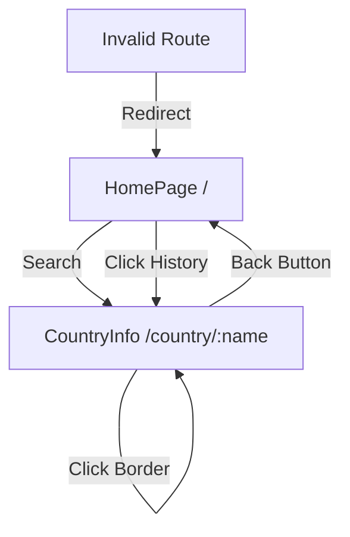

## Overview

Countrysweb uses [React Router v6](https://reactrouter.com/) for client-side routing. The app has a simple routing structure with just two main routes and a catch-all fallback.

## Router Setup

The router is initialized in the application entry point:

**Location**: `src/main.jsx`

```jsx main.jsx
import { createRoot } from "react-dom/client";
import { BrowserRouter } from "react-router-dom";
import { CountryProvider } from "./context/CountryProvider.jsx";
import App from "./App.jsx";

createRoot(document.getElementById("root")).render(
  <BrowserRouter>
    <CountryProvider>
      <App />
    </CountryProvider>
  </BrowserRouter>,
);
```

<Note>
  `BrowserRouter` is the outermost wrapper, providing routing capabilities to the entire app. It must wrap the `CountryProvider` to ensure context is available within routed components.
</Note>

## Route Configuration

Routes are defined in the root `App` component:

**Location**: `src/App.jsx`

```jsx App.jsx
import { Navigate, Route, Routes } from "react-router-dom";
import { BuscadorComponent } from "./components/BuscadorComponent.jsx";
import { CountryInfo } from "./components/CountryInfo.jsx";
import { HomePage } from "./components/HomePage.jsx";

function App() {
  return (
    <>
      <Routes>
        <Route path="/" element={<HomePage />} />
        <Route path="/country/:name" element={<CountryInfo />} />
        <Route path="*" element={<Navigate to="/" replace />} />
      </Routes>
    </>
  );
}

export default App;
```

## Routes

<CardGroup cols={2}>
  <Card title="Home" icon="house" href="#home-route">
    `/` - Main page with search and history
  </Card>
  <Card title="Country Detail" icon="flag" href="#country-detail-route">
    `/country/:name` - Individual country page
  </Card>
</CardGroup>

### Home Route

**Path**: `/`

**Component**: `HomePage`

```jsx
<Route path="/" element={<HomePage />} />
```

**Features:**
- Displays the country search interface (`BuscadorComponent`)
- Shows search history (`HistoryComponent`)
- No URL parameters
- Default landing page

**Example URLs:**
```
http://localhost:5173/
http://yourapp.com/
```

### Country Detail Route

**Path**: `/country/:name`

**Component**: `CountryInfo`

```jsx
<Route path="/country/:name" element={<CountryInfo />} />
```

**Features:**
- Dynamic route with `:name` parameter
- Displays detailed country information
- Name is normalized (lowercase, no accents, spaces replaced)
- Accessed via URL parameter using `useParams` hook

**Example URLs:**
```
http://localhost:5173/country/españa
http://localhost:5173/country/canada
http://localhost:5173/country/reino-unido
```

### Catch-All Route

**Path**: `*`

**Behavior**: Redirects to home

```jsx
<Route path="*" element={<Navigate to="/" replace />} />
```

**Purpose:**
- Handles all undefined routes
- Redirects users to home page
- Uses `replace` to avoid creating browser history entries

**Example:**
```
http://localhost:5173/invalid-path → Redirects to /
http://localhost:5173/random/page → Redirects to /
```

<Tip>
  The `replace` prop prevents users from getting stuck in redirect loops when using the back button.
</Tip>

## Navigation Flow

### From Search Form

<Steps>
  <Step title="User enters country name">
    Input can be Spanish name, English name, or 3-letter code
  </Step>
  <Step title="Form submission triggers search">
    Component searches the cached countries array
  </Step>
  <Step title="Navigate to country page">
    Uses `useNavigate` to programmatically navigate
    
    ```jsx
    const navigate = useNavigate();
    navigate(`/country/${normalize(nameCountry)}`);
    ```
  </Step>
  <Step title="CountryInfo component renders">
    Extracts name from URL params and fetches details
  </Step>
</Steps>

**Code from BuscadorCountry.jsx:**

```jsx BuscadorCountry.jsx
import { useNavigate } from "react-router-dom";
import { normalize } from "../utils/libs.js";

function BuscarCountry() {
  const navigate = useNavigate();
  const { countries, setIsLoading } = useCountry();

  const handleSearch = (e) => {
    e.preventDefault();
    const entry = inputRef.current.value;
    
    const pais = countries.find((country) => {
      const nameSpa = country.translations.spa.common;
      const nameEng = country.name.common;
      const cca3 = country.cca3;

      return (
        normalize(nameSpa) === normalize(entry) ||
        normalize(nameEng) === normalize(entry) ||
        normalize(cca3) === normalize(entry)
      );
    });

    if (!pais) {
      return setError(true);
    }
    
    setIsLoading(true);
    const nameCountry = pais.translations.spa.common;
    navigate(`/country/${normalize(nameCountry)}`);
  };
}
```

### From History

<Steps>
  <Step title="User clicks history item">
    History item contains country name and flag
  </Step>
  <Step title="Navigate to country page">
    Uses normalized country name from history
    
    ```jsx
    const handleClick = (country) => {
      navigate(`/country/${normalize(country)}`);
    };
    ```
  </Step>
  <Step title="CountryInfo component renders">
    Same flow as search navigation
  </Step>
</Steps>

**Code from HistoryComponent.jsx:**

```jsx HistoryComponent.jsx
import { useNavigate } from "react-router-dom";
import { normalize } from "../utils/libs";

export function HistoryComponent() {
  const { history } = useCountry();
  const navigate = useNavigate();
  
  const handleClick = (country) => {
    navigate(`/country/${normalize(country)}`);
  };

  return (
    <ul className="history-list">
      {history.map((country, index) => (
        <li
          key={index}
          onClick={() => handleClick(country.name)}
        >
          
          <p>{country.name}</p>
        </li>
      ))}
    </ul>
  );
}
```

### From Border Countries

<Steps>
  <Step title="User views country details">
    CountryInfo displays list of bordering countries
  </Step>
  <Step title="User clicks border country">
    BorderCountry component handles click
  </Step>
  <Step title="Navigate to border country">
    Navigates to the clicked border country's page
    
    ```jsx
    const handleSearchBorder = () => {
      navigate(`/country/${String(nameSpa).toLowerCase()}`);
    };
    ```
  </Step>
  <Step title="CountryInfo re-renders">
    Same component, different data based on new URL param
  </Step>
</Steps>

**Code from BorderCountry.jsx:**

```jsx BorderCountry.jsx
import { useNavigate } from "react-router-dom";

export const BorderCountry = ({ country }) => {
  const navigate = useNavigate();

  if (!country) return null;

  const nameSpa = country.translations.spa.common;

  const handleSearchBorder = () => {
    navigate(`/country/${String(nameSpa).toLowerCase()}`);
  };

  return (
    <li className="border-country" onClick={handleSearchBorder}>
      
      <p>{nameSpa}</p>
    </li>
  );
};
```

### Back to Home

<Steps>
  <Step title="User clicks back button">
    Button in CountryInfo component
  </Step>
  <Step title="Navigate to home">
    Simple navigation to root path
    
    ```jsx
    const handleBack = () => {
      navigate("/");
    };
    ```
  </Step>
  <Step title="HomePage component renders">
    Returns to search and history view
  </Step>
</Steps>

**Code from useCountryInfo.js:**

```jsx useCountryInfo.js
import { useNavigate } from "react-router-dom";

export const useCountryInfo = (name) => {
  const navigate = useNavigate();

  const handleBack = () => {
    navigate("/");
  };

  return {
    country,
    countries,
    handleBack,
    formatPopulation,
  };
};
```

## URL Parameter Handling

The `CountryInfo` component extracts the country name from the URL:

```jsx CountryInfo.jsx
import { useParams } from "react-router-dom";
import { useCountryInfo } from "../hooks/useCountryInfo";

export const CountryInfo = () => {
  const { name } = useParams();
  const { country, countries, handleBack, formatPopulation } =
    useCountryInfo(name);

  // Component renders based on country data...
};
```

<Note>
  `useParams` returns an object with all URL parameters. For `/country/:name`, it returns `{ name: "españa" }`.
</Note>

## Name Normalization

Country names in URLs are normalized for consistency:

**Location**: `src/utils/libs.js`

```js libs.js
export const normalize = (name) => {
  return name
    .toLowerCase()
    .normalize("NFD")
    .replace(/\s+/g, "-")
    .replace(/[\u0300-\u036f]/g, "")
    .replace(/_/g, " ")
    .replace(/-/g, " ")
    .trim();
};
```

**Transformations:**
- Convert to lowercase
- Remove accents (NFD normalization)
- Replace spaces with hyphens
- Remove diacritical marks
- Trim whitespace

**Examples:**
```js
normalize("España")           // → "espana"
normalize("United Kingdom")    // → "united kingdom"
normalize("República Checa")  // → "republica checa"
```

<Warning>
  The normalization function is crucial for reliable routing. Without it, URLs with special characters or accents could fail.
</Warning>

## Navigation Hooks

### useNavigate

Programmatically navigate between routes:

```jsx
import { useNavigate } from "react-router-dom";

const navigate = useNavigate();

// Navigate to a route
navigate("/country/spain");

// Navigate back
navigate(-1);

// Navigate forward
navigate(1);

// Replace current entry (no history)
navigate("/", { replace: true });
```

**Used in:**
- BuscadorCountry
- HistoryComponent
- BorderCountry
- useCountryInfo hook

### useParams

Access URL parameters:

```jsx
import { useParams } from "react-router-dom";

const { name } = useParams();
// For /country/españa, name = "españa"
```

**Used in:**
- CountryInfo component

## Navigation Diagram



## Browser History

The app creates proper browser history entries:

- Users can use browser back/forward buttons
- Navigation stack is maintained
- Catch-all redirect uses `replace` to avoid history pollution

**History Stack Example:**

```
1. /                          (home)
2. /country/espana            (search Spain)
3. /country/francia           (click border France)
4. /country/alemania          (click border Germany)
5. /                          (click back button)
```

Browser back button navigates through this stack normally.

## Routing Best Practices

### Do's

<Check>Use `useNavigate` for programmatic navigation</Check>
<Check>Extract URL params with `useParams`</Check>
<Check>Normalize country names for consistent URLs</Check>
<Check>Use `replace` for redirects that shouldn't be in history</Check>
<Check>Handle invalid routes with catch-all</Check>

### Don'ts

<Warning>Don't use `<a>` tags for internal navigation (causes full page reload)</Warning>
<Warning>Don't forget to normalize names before navigating</Warning>
<Warning>Don't create routes that could conflict with each other</Warning>
<Warning>Don't navigate without validating data first</Warning>

## Loading States During Navigation

The app manages loading states during navigation:

```jsx
const handleSearch = (e) => {
  e.preventDefault();
  // ...
  setIsLoading(true);  // Show loading indicator
  navigate(`/country/${normalize(nameCountry)}`);
};
```

The `CountryInfo` component's `useCountryInfo` hook then:
1. Fetches detailed country data
2. Sets `isLoading(false)` when done
3. Global `Loading` component responds automatically

<Tip>
  This pattern provides smooth transitions between pages with loading feedback.
</Tip>

## Future Routing Enhancements

Potential improvements:

1. **Query Parameters**: Add filters (region, population range)
   ```jsx
   /country/spain?details=full&lang=en
   ```

2. **Nested Routes**: Organize by region
   ```jsx
   /region/europe/spain
   /region/asia/japan
   ```

3. **Route Guards**: Prevent navigation if data isn't loaded

4. **404 Page**: Custom error page instead of redirect

5. **Scroll Restoration**: Remember scroll position on back navigation